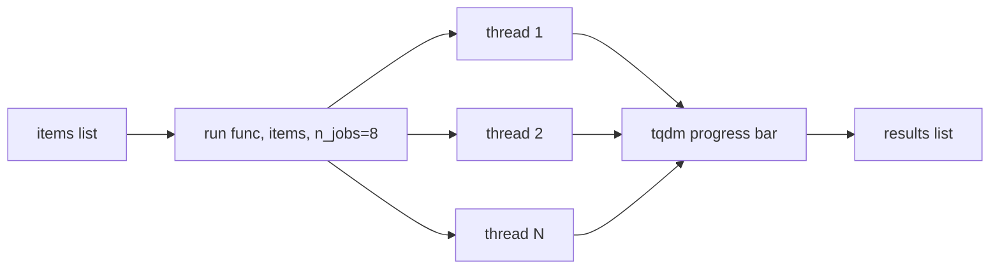

# scitex-parallel

<p align="center">
  <a href="https://scitex.ai">
    
  </a>
</p>

<p align="center"><b>Thread/process pool parallel execution utilities — `map` with tqdm, auto CPU count.</b></p>

<p align="center">
  <a href="https://scitex-parallel.readthedocs.io/">Full Documentation</a> · <code>uv pip install scitex-parallel[all]</code>
</p>

<!-- scitex-badges:start -->
<p align="center">
  <a href="https://pypi.org/project/scitex-parallel/"></a>
  <a href="https://pypi.org/project/scitex-parallel/"></a>
  <a href="https://scitex-parallel.readthedocs.io/en/latest/"></a>
  <a href="https://www.gnu.org/licenses/agpl-3.0"></a>
</p>
<p align="center">
  <a href="https://github.com/ywatanabe1989/scitex-parallel/actions/workflows/ci.yml"></a>
  <a href="https://codecov.io/gh/ywatanabe1989/scitex-parallel"></a>
</p>
<!-- scitex-badges:end -->

---

## Problem and Solution

| # | Problem | Solution |
|---|---------|----------|
| 1 | **Rewritten map loops** — `concurrent.futures` is low-level, so every project rewrites map-with-progress-bar from scratch | **`stx.parallel.run(func, args)`** — drop-in `map` with tqdm, auto CPU-count; 1-liner for I/O-bound workloads (HTTP, file reads, API calls) |
| 2 | **Heavyweight defaults** — `joblib.Parallel` is process-based by default, overkill for threaded I/O | **Thread pool default** — thread-based with no dep beyond stdlib + tqdm; the right tool for the 80% case |

## Quick Start

```python
from scitex_parallel import run

results = run(my_func, [(x,) for x in items], n_jobs=4)
```

## Demo



<p align="center"><sub><b>Figure 1.</b> Fan-out/fan-in: one call maps items across a thread pool with a live progress bar, then gathers results in order.</sub></p>

```python
from scitex_parallel import run

urls = ["https://api.example.com/{}".format(i) for i in range(100)]
results = run(fetch_url, [(u,) for u in urls], n_jobs=8, desc="Fetching")
```

```
Fetching: 100%|████████████| 100/100 [00:04<00:00, 22.3 it/s]
```

## Installation

```bash
uv pip install "scitex-parallel[all]"
```

Through the umbrella: `uv pip install "scitex[parallel]"`. Requires Python ≥ 3.10.

<details>
<summary><b>Per-extra installs</b></summary>

<br>

| Extra | Pulls in |
|---|---|
| `dev` | `pytest`, `pytest-cov`, `ruff`, `scitex-dev` |
| `docs` | `sphinx`, `sphinx-rtd-theme`, `myst-parser`, `sphinx-copybutton`, `sphinx-autodoc-typehints` |

</details>

## Architecture


<p align="center"><sub><b>Figure 2.</b> Module layout: the public <code>run()</code> fans tuple-args out to pool workers and streams progress back through tqdm.</sub></p>

## 1 Interfaces

<details open>
<summary><strong>Python API</strong></summary>

<br>

```python
from scitex_parallel import run

# I/O-bound parallel map with tqdm progress bar.
results = run(fetch_url, [(u,) for u in urls], n_jobs=8, desc="Fetching")

# Tuple-arg form for multi-arg functions.
results = run(my_func, [(a, b) for a, b in zip(xs, ys)], n_jobs=4)
```

</details>

## Part of SciTeX

> `scitex-parallel` is part of [**SciTeX**](https://scitex.ai). Install via
> the umbrella with `pip install scitex[parallel]` to use as
> `scitex.parallel` (Python) or `scitex parallel ...` (CLI).

>Four Freedoms for Research
>
>0. The freedom to **run** your research anywhere — your machine, your terms.
>1. The freedom to **study** how every step works — from raw data to final manuscript.
>2. The freedom to **redistribute** your workflows, not just your papers.
>3. The freedom to **modify** any module and share improvements with the community.
>
>AGPL-3.0 — because we believe research infrastructure deserves the same freedoms as the software it runs on.

## License

AGPL-3.0

---

<p align="center">
  <a href="https://scitex.ai" target="_blank"></a>
</p>
